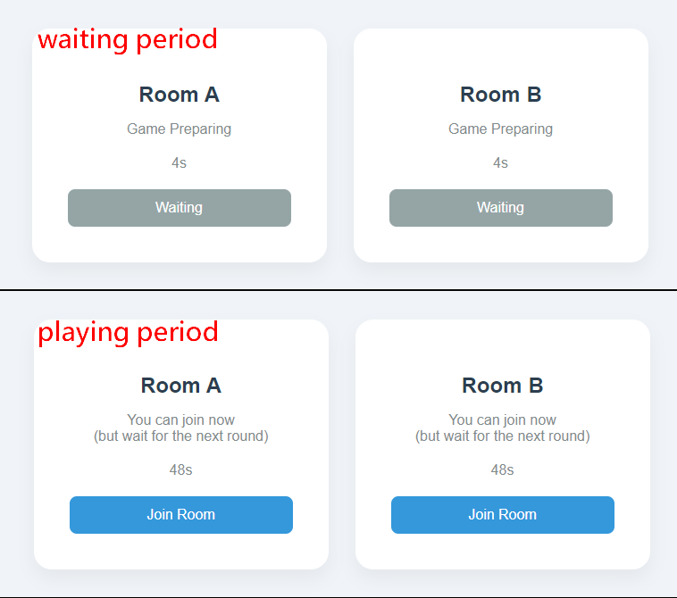
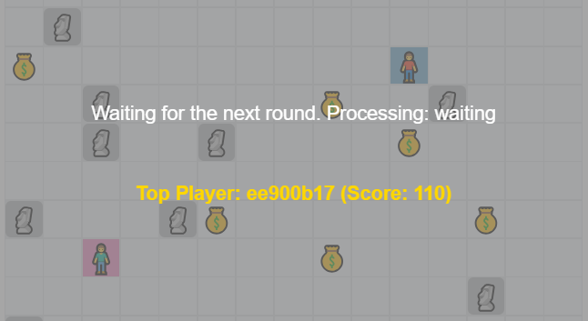

# pickup

## Introduction
Pickup is a fast-paced multiplayer game where players compete in a 15x15 grid to collect points and use strategic power-ups. Players can move their characters using the arrow keys (up, down, left, right) and can activate abilities or collect items by standing on them and pressing the spacebar. These actions help players gain points and outmaneuver their opponents in the race to victory.

## Showcase
* Login page

  For the sake of server security and ease of deployment, only Google account login is currently supported.
  

* **Room selection**

    During the waiting phase, players are temporarily prohibited from entering. In the game phase, you can adjust whether players are allowed to forcefully join the game through the config settings. If the RUNNING_GAME_JOIN_PROTECT parameter is set to false, players can forcefully join the game without waiting for the next round, starting the game at the same point as other players.
  

* **Game playing**

  Players can move using the arrow keys on the keyboard. By pressing the spacebar while standing on an item, they can collect the item and earn scores. Obstacles (such as occupied items) will block movement and cannot be picked up. Players will also block each other(collision detection).
  

* **Game ended and waiting for the next round**

    The game will pause after round ended, and all players will be unable to continue. The player with the highest score in the current round will be displayed, and then the game will enter the cleanup phase, where the data from the previous round will be cleared. A new round will then begin. If a player leaves before the cleanup phase, the server will disconnect the player. If the player does not leave, they will automatically enter the next round.
  

## Features
### **Implemented:**
* :white_check_mark: multiplayer connectivity support
* :white_check_mark: high-concurrency handling
* :white_check_mark: disconnected reconnection recovery
* :white_check_mark: server authority
* :white_check_mark: collision detection
* :white_check_mark: game room system
* :white_check_mark: turn-based system
* :white_check_mark: anti-cheating system

### **Not implemented:**
* :black_square_button: persistent scores
* :black_square_button: AI player
* :black_square_button: bomberman simulation

## Architecture

## Sequence Diagram
